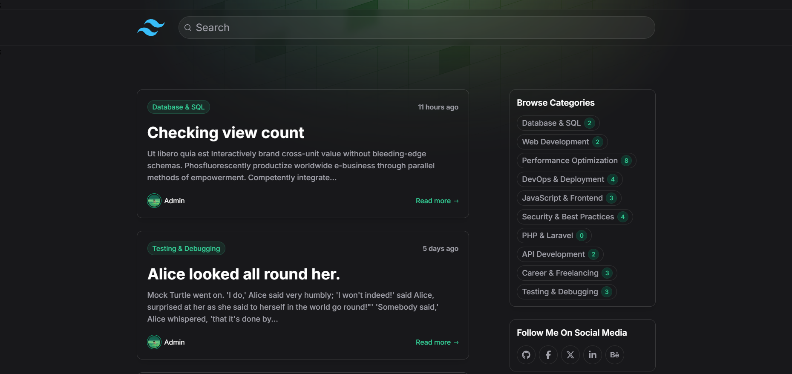
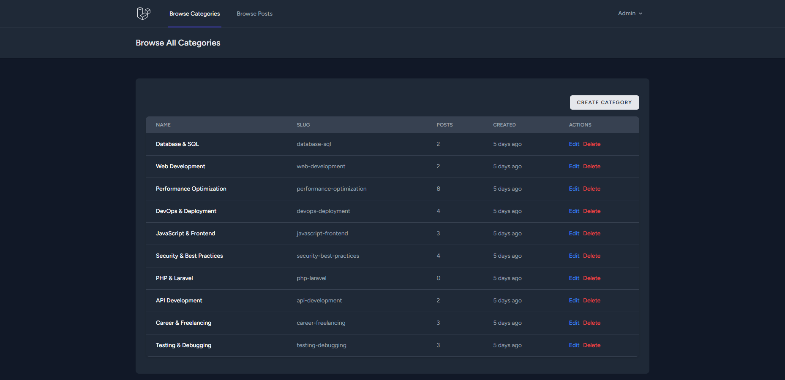
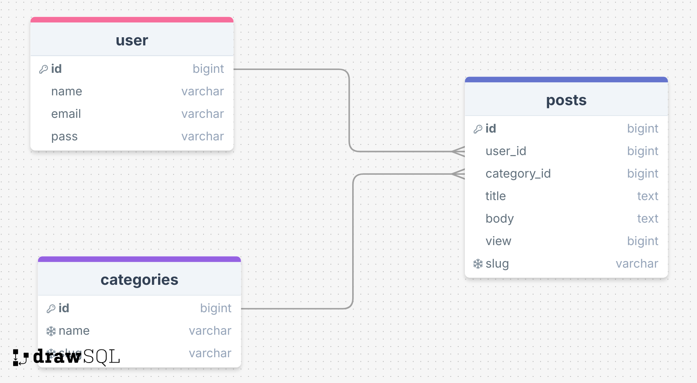

# Blog Platform

A modern blog platform built with Laravel and Tailwind CSS featuring an admin panel for content management. The platform allows administrators to manage blog posts and categories while providing a seamless reading experience for visitors.


*Clean and modern blog homepage with search and category filters*


*Powerful admin dashboard for content management*

---

## 🚀 Features

### For Visitors
- 📱 **Responsive design** optimized for all devices
- 🔍 **Advanced search functionality** (real-time search, full-text search on titles and content)
- 🏷️ **Category-based post filtering**
- 👁️ **Post view counter**
- 📅 **Time-ago post dates**
- 📖 **Post excerpt previews**
- 📄 **Pagination** for smooth browsing

### For Admin
- 🔐 **Secure admin dashboard** (only accessible by admins)
- 📝 **Full CRUD operations for posts**
- 📂 **Category management**
- 📊 **View post statistics** (views, post count, etc.)
- 🔗 **SEO-friendly URLs with slugs**
- 🔄 **Optimized database queries with eager loading**

---

## 🛠️ Tech Stack

### Backend
- **Framework:** Laravel 11
- **Database:** MySQL
- **Authentication:** Laravel Breeze
- **Authorization:** Admin-only access

### Frontend
- **CSS Framework:** Tailwind CSS
- **Templating:** Blade
- **Icons:** Heroicons
- **JavaScript:** Alpine.js
- **Responsive Design:** Mobile-first approach

---

## 🏗️ Database Structure



### Posts Table
- id (primary key)
- user_id (foreign key)
- category_id (foreign key, nullable)
- title
- slug (unique)
- body
- views
- timestamps

### Categories Table
- id (primary key)
- name
- slug (unique)
- timestamps

---

## 🛣️ Routes

### Public Routes
- `/` - Blog homepage with search and category filters
- `/post/{slug}` - Single post view
- `/category/{slug}` - Category filtered posts

### Admin Routes (Protected)
- `/admin/posts` - Post management
- `/admin/categories` - Category management
- `/admin/posts/create` - Create new post
- `/admin/categories/create` - Create new category

---

## 🔑 Admin Credentials
To access the **admin dashboard**, use the following credentials:

**Email:** `admin@gmail.com`

**Password:** `admin123`

*(You can change these credentials after running database migrations.)*

---

## 🔄 Key Features Implementation

### 🔎 Search Functionality
- Full-text search across post titles and content
- Real-time search results
- Category-based filtering

### 📝 Post Management
- Create, edit, delete posts
- Assign categories
- SEO-friendly slugs
- View tracking

### 🏷️ Category System
- CRUD operations
- Post count display
- Category-based post filtering

### 📱 Responsive Design
- Mobile-first approach
- Clean and modern UI
- Optimized for all screen sizes

### ⚡ Performance Features
- **Eager loading relationships** to optimize database queries
- **Pagination** to improve loading speed and usability

---

## 📦 Seeded Data

When you run database migrations, the system will auto-generate:
- ✅ **10 predefined categories**
- ✅ **Sample blog posts**
- ✅ **Admin user account**

---

## ⚡ Installation & Setup

### 1️⃣ Prerequisites
Please check the [Laravel Official Documentation](https://laravel.com/docs/master/installation) for server requirements before you start.

### 2️⃣ Clone this repository:

```bash
git clone https://github.com/Redoan-Hasan/Blog-Project-.git
```

Switch to the repository folder:

```bash
cd Blog-Project-
```

### 3️⃣ Install Dependencies

```bash
composer install
```

```bash
npm install
```

### 4️⃣ Configure Environment Variables
Copy the `.env.example` file and make the required configuration changes in the `.env` file:

```bash
cp .env.example .env
```

### 5️⃣ Generate Application Key

```bash
php artisan key:generate
```

### 6️⃣ Set Up the Database
Run the database migrations (set the database connection in `.env` before migrating):

```bash
php artisan migrate --seed
```

*(The `--seed` flag will generate sample data, including the admin user.)*

### 7️⃣ Start the Local Server

```bash
php artisan serve
```

### 8️⃣ Start Vite for Frontend Assets

```bash
npm run dev
```

You can now access the server at **[http://127.0.0.1:8000](http://127.0.0.1:8000)**.

---

### TL;DR - Quick Install Steps

```bash
git clone https://github.com/Redoan-Hasan/Blog-Project-.git
cd Blog-Project-
composer install
npm install
cp .env.example .env
php artisan key:generate
php artisan migrate --seed
php artisan serve
npm run dev
```

🚀 **Enjoy your Laravel Blog Platform!** 🚀

